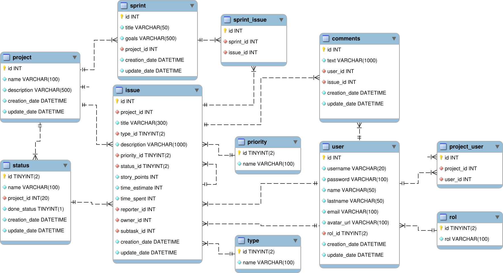

# Database: `jira_fake`
- [Database: `jira_fake`](#database-jira_fake)
  - [ER Diagram](#er-diagram)
  - [Setup MySQL server](#setup-mysql-server)
    - [Build](#build)
    - [Run](#run)
    - [Connect](#connect)
      - [MySQL Client](#mysql-client)
      - [MyCli](#mycli)
  - [Reset the database](#reset-the-database)

## ER Diagram


## Setup MySQL server
### Build
```zsh
docker build -t jira-fake:mysql2 . -f mysql-server.Dockerfile
```

### Run
Setup the password as an environment variable.
```zsh
MYSQL_PWD=changeMePleaseIBegYou     # change this

[ -z "$(grep "MYSQL_PWD" ~/.bashrc)" ] && echo >> ~/.bashrc && \
echo "export MYSQL_PWD=${MYSQL_PWD}" >> ~/.bashrc
```

Run the container
```zsh
docker run --name jira-fake-db -p 8080:3306 -e MYSQL_ROOT_PASSWORD=${MYSQL_PWD} -e MYSQL_ROOT_HOST=% -d jira-fake:mysql
```

### Connect
#### MySQL Client
**Connect** with `mysql client`.
```zsh
mysql --port=8080 -u root -p${MYSQL_PWD} -D jira-fake
```

#### MyCli
I like `mycli` with `pspg` pager better.
```zsh
# Dependencies and config files
sudo apt-get install pspg
ln -sr clienf-config/my.cnf ~/.my.cnf
ln -sr clienf-config/myclirc ~/.myclirc

# Connect
mycli --port=8080 -u root -p${MYSQL_PWD} -D jira-fake

# Create an alias if feeling lazy
echo >> ~/.bashrc
echo "alias jira-fake-db='mycli --port=8080 -u root -p${MYSQL_PWD} -D jira-fake'" >> ~/.bashrc
source ~/.bashrc

# Then connect with
jira-fake-db
```

## Run script / reset the database
```zsh
mysql -h 0.0.0.0 --port=8080 -u root -p${MYSQL_PWD} < jira-fake.sql
```
[*Up*](#database-jira_fake)
